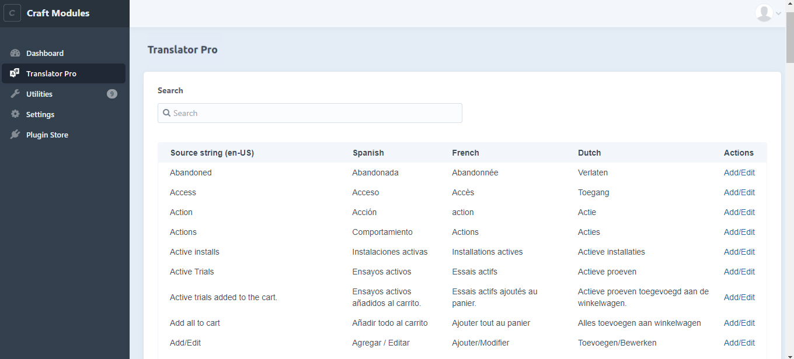
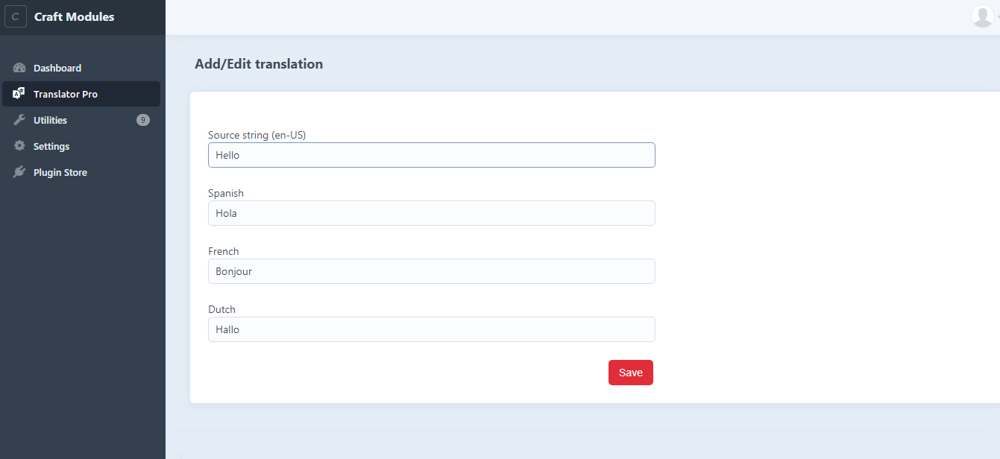

# Translator Pro plugin for Craft CMS 3.x

This plugin will have a control panel interface to edit your static translations in the database.

## Features

- You can do Website, plugin and Craft Commerce translations
Override of default 't' function (both twig and php usage)
- A paginated overview of and manage all the site translations in Manage translations page with a search and filter option
- The possibility to manage each site translation
- Usage of database source messages instead of files 
- Website translations will be shown dependent on will apply to website according to the users language
- The possibility to manage translations for development strings

## Documentation

Visit the [Translator Pro Plugin page](https://github.com/infanion-plugins/Translator-pro) for all documentation, guides and developer resources.

## Requirements

This plugin requires Craft CMS 3.0.0-beta.23 or later.

## Installation

To install the plugin, follow these instructions.

1. Open your terminal and go to your Craft project:

        cd /path/to/project

2. Then tell Composer to load the plugin:

        composer require ip/translator-pro

3. In the Control Panel, go to Settings → Plugins and click the “Install” button for Translator Pro.

## Support

Get in touch with us via the mail [Translator Pro Support mail](mailto:support-craftplugins@infanion.com) or by [creating a Github issue](https://github.com/infanion-plugins/Translator-pro/issues)

## Translator Pro Roadmap

- Import translations
- Export translations
- CP configuration/settings

Brought to you by [Infanion](https://www.infanion.com/)
